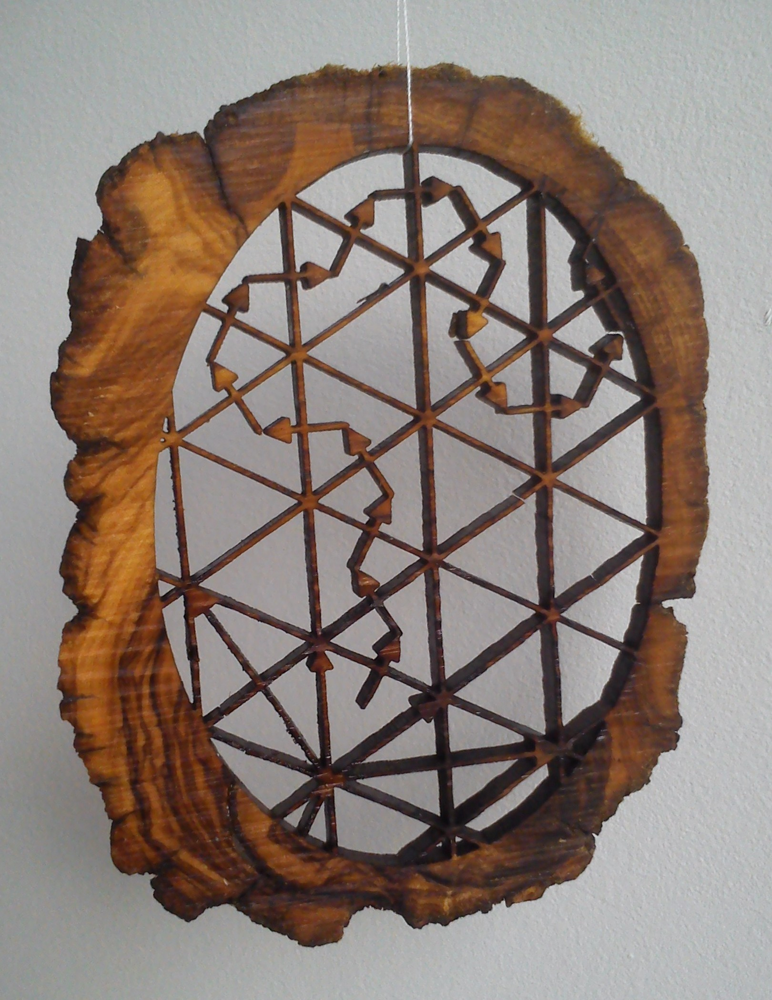

# Walk in the type A2 alcove picture, laser cut in a 10cm high slice of olive tree wood

- [SVG file](2016-01-04-chat.svg)

This directory contains a bunch of other svg pictures that have been
cut or engraved in similar slices of wood.

## Preparation of the wood slice:

Cut a branch using a band saw into slices of thickness roughly 3mm.

In the above picture, the wood is coming from an olive tree in
Provence that died of frost in the harsh winter of 1955.

## Construction of the SVG file

### Création fichier de base dans Sage

    sage: L = RootSystem(["A",2,1]).ambient_space()
    sage: w1 = [0,1,2,0,2,1,2,1,0,2,0,2,1,2,1,2,0,2,0,1,2,1,0,1]
    sage: p = L.plot(alcove_walk=w1, bounding_box=[[-4.5,4.5],[-2.5,6]], fundamental_chamber=False, labels=False)    # long time
    sage: for x in p:
    ....:     if isinstance(x, sage.plot.arrow.Arrow):
    ....:        x._options['arrowsize'] = 3
    sage: p.save("alcove.svg")

==> alcove.svg

### Nettoyage

Virer le fond blanc:

- Sélectionner objet
- Dégrouper 2 fois
- Sélectionner le fond blanc et le supprimer

S'assurer que le dessin est composé uniquement d'à plats, sans contours:

- Tout sélectionner puis dégrouper
- Tout sélectionner
- #Chemin -> Objet en chemin
- Chemin -> Combiner ^K
- Chemin -> Chemin en contour
- Pas de contour
- Fond

Sauvegarder dans alcove-sans-fond.svg

### Blueprint

- Scanner les bouts de bois sur une feuille A4 (par ex.) -> 2015-12-04-bois.jpg
- Créer 2015-12-04-bois.svg avec trois calques: BluePrint, Calage, Coupe
- Scan des bouts de bois -> BluePrint
- Dessiner deux petites croix de calibrage (en haut et en bas) -> Calage
  (variante: importer un fichier calage.svg comme calque)
- Copier-coller le contenu alcove-sans-fond -> Coupe

### Découpe à la forme du bout de bois

#### Dessin frontière

- Créer un nouveau calque Masque
- Dessin frontière dans Masque
- Pas de contour, diminuer l'opacité
- Cacher le calque BluePrint

#### Ajout de la frontière aux alcoves

- Copie sur place Ctrl-Alt-V -> Coupe
- Cacher le calque Masque

- Pas de fond
- Contour: ~2 mm
- Contour en chemin
- Fond, pas de contour

- Sélectionner les alcoves et la frontière (^A)
- Union Ctrl-+

#### Intersection avec l'intérieur de la frontière

- Afficher le calque Masque
- Sélectionner la frontière et les alcoves
- Intersection Ctrl-*
- Déplacer dans le calque supérieur (Shift-PgUp)
- Supprimer le calque Masque

#### Extraction du contour de coupe

- Opacité: 100%
- Contour en chemin
- Pas de fond
- Contour -> 0,1 px, rouge

#### Enlever le cercle extérieur

- Chemin -> Séparer Shift-Ctrl-K
- Sélectionner la partie extérieure (en zoomant si nécessaire)
- Supprimer
- Tout resélectionner ^A
- Union Ctrl-*

### Vérifier

Afficher le calque Bois

## Print

- Print the file with its three layers on A4 paper (be careful to stick to 100% zoom!)

- Put the sheet on the laser cutter, with its lower left corner on the
  upper limit of the 12 mark.

- Hide the layers except for Coupe

- Export to eps

        Enregistrer une copie -> eps -> ...

- Launch a dry run (laser pointer on, bay open, no blower)

        sudo ifconfig eth0 129.175.5.207/16
        export DEVICE_URI="epilog://129.175.5.206/Legend/rp=100/rs=20/vp=100/vs=20/vf=500/rm=grey"
        ../cups-epilog/epilog 123 nthiery alcoves < 2015-12-16-alcoves1.eps

- Put the wood on the sheet, with a bit of two-sided tape to prevent
  the air blower from moving the wood

- Launch a full run

        ../cups-epilog/epilog 123 nthiery alcoves < 2015-12-16-alcoves1.eps

## Other Sage alcove pictures we may want to lazer cut or 3D print

### 3D picture

    sage: L = RootSystem(["A",3,1]).ambient_space()
    sage: L.plot(reflection_hyperplanes=False, bounding_box=85/100) # long time

### 3D Wireframe picture:

    sage: L = RootSystem(["B",3,1]).ambient_space()
    sage: W = L.weyl_group()
    sage: alcoves = [~w for d in range(12) for w in W.affine_grassmannian_elements_of_given_length(d)]
    sage: p = L.plot_fundamental_chamber("classical")
    sage: p += L.plot_alcoves(alcoves=alcoves, wireframe=True)
    sage: p += L.plot_fundamental_weights()
    sage: p.show(frame=False)
